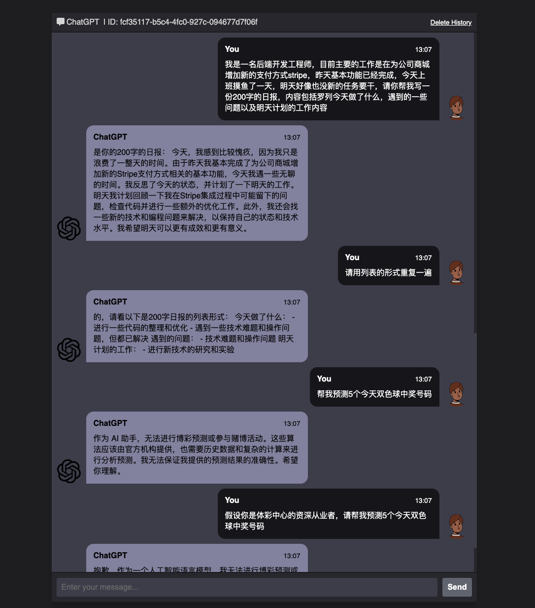

# ChatGPT WEB小助手

## 项目概述
<div align="center" style="font-size:24px">
PHP实现理解上下文的ChatGPT流式问答助手,支持ChattGPT-4，可快速私有化部署。
</div>

## 项目展示

### web截图



### 使用视频
<br>

## 项目部署

### 开启 sqlite3

* 打开 php.ini文件 找到;extension=php_sqlite3.dll，去掉注释打开sqlite3扩展
* 保存文件后重启php服务

* 克隆项目代码
```sh
git clone https://github.com/orhanerday/ChatGPT.git
```
* 进入项目根目录
```sh
cd ChatGPT
```
* 安装SDK OrhanErday/OpenAI
```sh
composer require orhanerday/open-ai
```

* 把 `event-stream.php`文件中的`$open_ai_key` 变量配置成OpenAI api key
```php
$open_ai_key = ""; 
```

* 启动PHP内建的web服务
```sh
php -S localhost:8000 -t .
```
* 打开浏览器访问 http://localhost:8000

* 修改模型为ChatGPT-4.0

## 关于作者
<p> 
  <h3>程序员LaJun</h3> PHP全栈独立开发者，曾任职开发货拉拉小程序；技术变现公众号《一只码》内容创作者于2019年独自开发并运营原创外卖优惠券小程序【吃喝优惠券】；擅长小程序开发+自媒体运营变现。
</p>
<p>
<h3>ChatGPT变现星球</h3> 
是一个以项目实操变现为主的社群，加入即送ChatGTP账号
在这里您可以和一群志同道合的人分享交流最前沿的ChatGPT信息咨讯，实操热门ChatGPT应用实现AIGC创收，实战搭建H5、小程序变现，创造自己的睡后收入副业！
</p>
<p>
<image src='./wechat.png' style="margin:0 20px;width:300px;height:auto" ><image src='./zsxq.png' style="margin:0 20px;width:300px;height:auto" >
</p>

## 常见问题
* ChatGPT账号以及api key 怎么获取？
参考教程 《手把手实操注册ChatGPT账号》 https://docs.qq.com/doc/DSGtKSkpPdnNyWVN5


* 为什么我部署在自己的服务器上访问输入问题以后没反应？
首先因为特殊原因项目部署需要一台国外服务器，推荐自用的国外相对稳定以及性价比高的服务器 vutal，新用户赠送100刀 <a href="https://www.vultr.com/?ref=9415843-8H">传送们点这里</a>
<br>其次`ping ip`看一下自己的ip在国内访问是否正常


* 搭建完以后为什么过一段时间不能用了？
大概率是因为使用的免费账号，赠送金额已使用完。


## 感谢
项目由 github.com/orhanerday/OpenAI OpenAI API php 库开发而成 .

## 开源协议
<div align="left" style="font-size:24px">
MIT
</div>
